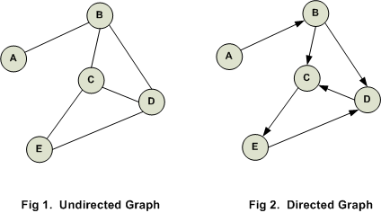

# Graph :
Graphs are one of the most frequently used data structures,along with linked lists and trees.

# Important Terms
We can represent a graph using an array of vertices and a two-dimensional array of edges. Before we proceed further, let's familiarize ourselves with some important terms.

In the above graph,

**V** = {a, b, c, d, e}

**E** = {ab, ac, bd, cd, de}

**Following are the important terms with respect to graph.**

- **Vertex:** Each node of the graph is represented as a vertex. In the following example, the labeled circle represents vertices. Thus, A to G are vertices. We can represent them using an array as shown in the following image. Here A can be identified by index 0. B can be identified using index 1 and so on.
- **Edge:** Edge represents a path between two vertices or a line between two vertices. In the following example, the lines from A to B, B to C, and so on represents edges. We can use a two-dimensional array to represent an array as shown in the following image. Here AB can be represented as 1 at row 0, column 1, BC as 1 at row 1, column 2 and so on, keeping other combinations as 0. 
- **Adjacency:**  Two node or vertices are adjacent if they are connected to each other through an edge. In the following example, B is adjacent to A, C is adjacent to B, and so on.
- **Path:** Path represents a sequence of edges between the two vertices. In the following example, ABCD represents a path from A to D.

---
content source : https://www.tutorialspoint.com/data_structures_algorithms/graph_data_structure.htm
